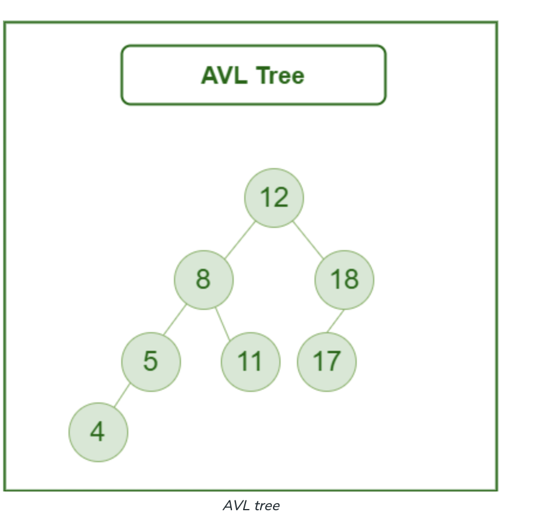
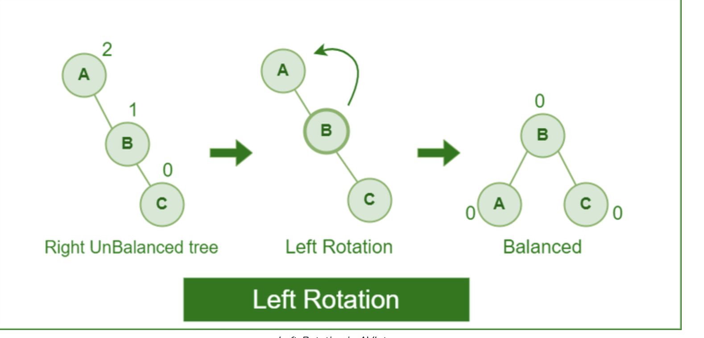
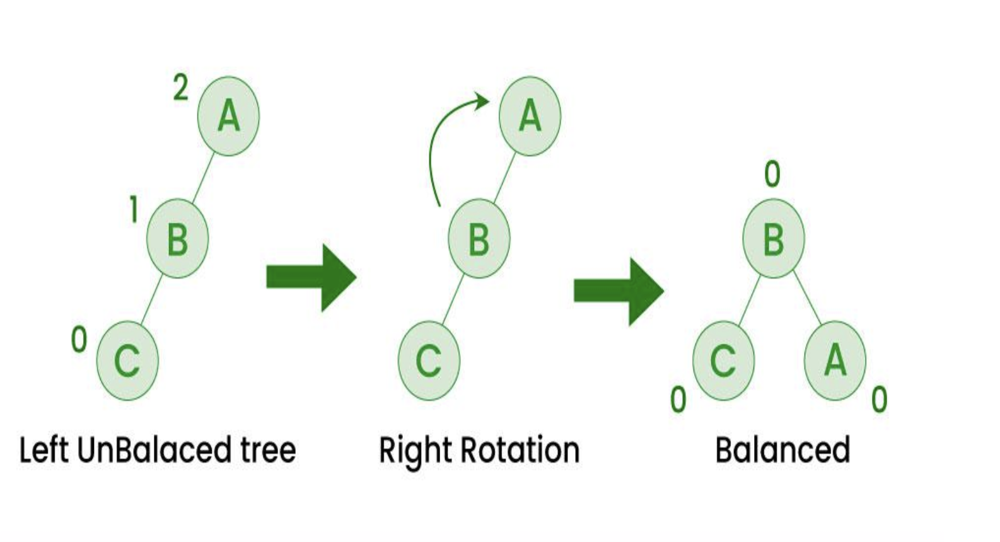
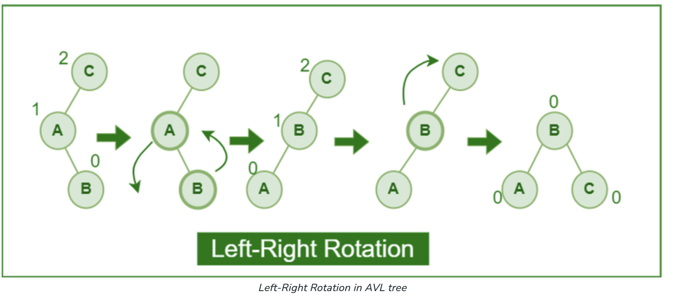
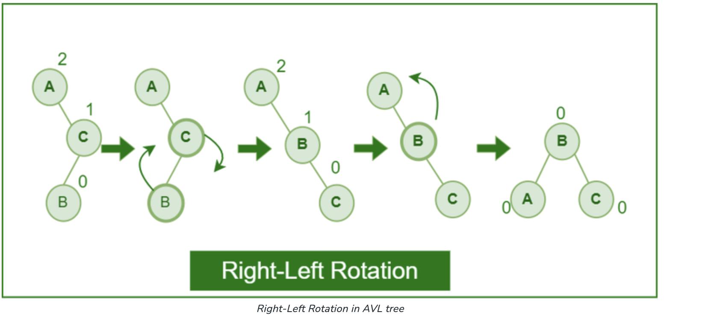

# AVL Trees

An AVL tree defined as a self-balancing Binary Search Tree (BST) where the difference between heights of left and right subtrees for any node cannot be more than one.

# Rotations

To keep itself balanced, an AVL tree rotates.

## Left Rotation

When a node is added into the right subtree of the right subtree, if the tree gets out of balance, we do a single left rotation.

## Right Rotation

If a node is added to the left subtree of the left subtree, the AVL tree may get out of balance, we do a single right rotation.

## Left-Left Rotation

A left-right rotation is a combination in which first left rotation takes place after that right rotation executes.

## Right-Right Rotation

A right-left rotation is a combination in which first right rotation takes place after that left rotation executes.

