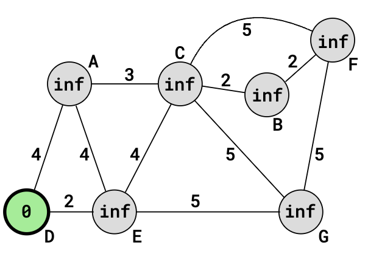
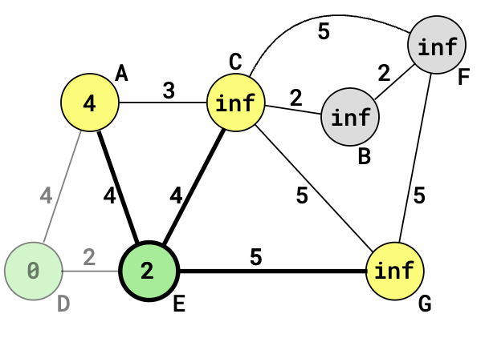
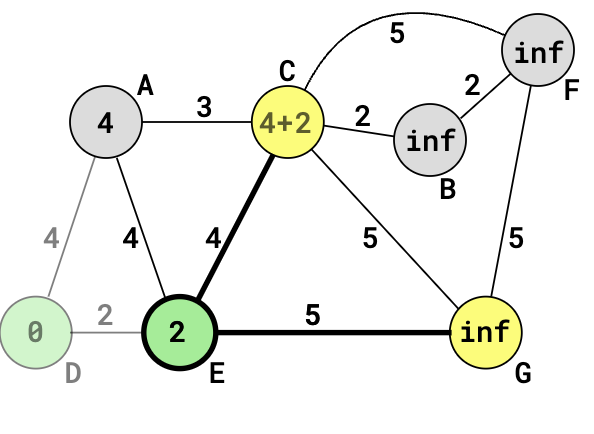
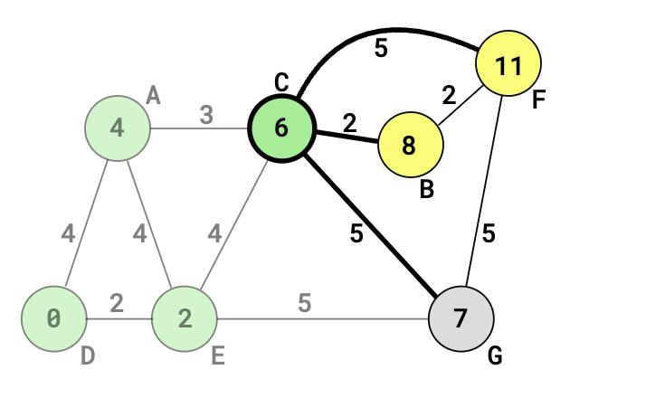

# Dijkstras Algorithm

This algorithm finds the shortest path from source to all other vertices.

## Algorithm

- Create a set sptSet (shortest path tree set) that keeps track of vertices included in the shortest path tree, i.e., whose minimum distance from the source is calculated and finalized. Initially, this set is empty. 
- Assign a distance value to all vertices in the input graph. Initialize all distance values as INFINITE. Assign the distance value as 0 for the source vertex so that it is picked first. 
- While sptSet doesn’t include all vertices 
    - Pick a vertex u that is not there in sptSet and has a minimum distance value. 
    - Include u to sptSet. 
    - Then update the distance value of all adjacent vertices of u. 
        - To update the distance values, iterate through all adjacent vertices. 
        - For every adjacent vertex v, if the sum of the distance value of u (from source) and weight of edge u-v, is less than the distance value of v, then update the distance value of v. 

# Example

** STEP 1 **

1. Initialize
    - The set ** SptSet ** is initially empty
    - Src = 0 
    - All other distances are INFINITE
2. Update ** sptSet **
    - Choose vertex with minimum distance (aka src) to be in ** sptSET ** 
    - Update distance values of adjacent vertices
3. Adjacent vertices of D are A and E. The distance values of 4 and 2 and updated.
    - Add values of A + E to update E

** STEP 2 **

1. Update ** setSPT **
    - Choose the minimum distance that is not already included in ** sptSET ** and add to ** sptSET **
    - Update the distances of adjacent vertices of E
        - Adjacent vertices are A (4), C (4), and G(5)
        - Go from E to C
    - Distance value of vertex C becomes 6
    - ** sptSET ** is now {A, E, C}

** STEP 3 **

1. Update ** sptSET ** with minimum distance
    - Choose the minimum distance that is not already included in ** sptSET ** and add to ** sptSET **
    - Update the distances of adjacent vertices of C
        - Adjacent vertices are F(5), B(2), G(5)
        - Go from C to B
    - Distance value of vertex B becomes 8
    - Distance value to vertex G becomes 7
    - ** sptSET ** is now {A, E, C, B}

** STEP 4 **

1. Update ** sptSET ** with minimum distance
    - Choose the minimum distance that is not already included in ** sptSET ** and add to ** sptSET **
    - Update the distances of adjacent vertices of B
        - Adjacent vertices are F(2)
        - Distance value of vertex F becomes 10
    - ** sptSET ** is now {A, E, C, B, F}

