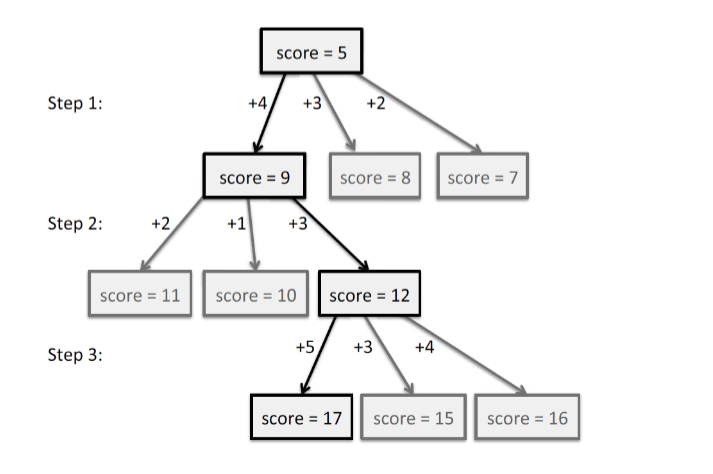
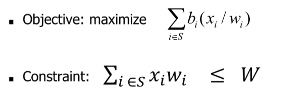

# Greedy Method

The greedy method is a general algorithm design that focuses on finding the most optimal choice. It is built on the following elements:

1. configurations: different choices, collections, or values to find
2. objective function: a score assigned to configurations, which we want to either maximize or minimize

It works best when applied to problems with the **greedy choice** property
- a globally-optimal solution can always be found by a series of local improvements from a starting configuration

## Key Characteristics 

1. Locality - The algorithm makes decisions from the given solution based on local optimization
2. Irreversibility - Once a decision is made, it is not reconsidered
3. Feasability - Maintains a feasible solution at each step

## How does it Work?

The sequence of choices starts from some well-understood starting configuration, and then iteratively makes the decision that is best from all of those that are currently possible, in terms of improving the objective function.



## Example: Coin Change Problem

Problem Statement: Given an amount N and a list of denominations for coins C = {c1, c2, c3,...cm}, find the minimum number of coins that you need to make up that amount. Assume an unlimited supple of each coin denomination.

**STEPS**

1. Start with the largest denomination of coin that is less than or equal to the given amount N
2. Choose as many coins of this denomination without exceeding the amount
3. Subtract the total value of these coins from N, finding the remaining balance
4. Repeat the process with the next largest denomination
5 Continue until N becomes 0, or the balance is 0.

**EXAMPLE**

Amount N = 93
Coin denominations: C = {1, 5, 10, 25}

1. 93/25 = 3 --> Three 25 cent coins can be used
2. 93-75 = 18 --> Updated balance
3. 18/10 = 1 --> One 10 cent coin can be used
4. 18-10 = 8 --> Updated balance
5. 8/5 = 1 --> One 5 cent coin can be used
6. 8-5 = 3 --> Updated balance
7. 3/1 = 3 Three one cent coins can be used.
8. 3-3 = 0

Coins used: Three 25 cent, one ten cent, one five cent, and three one cents.

# Knapsack Problem

Given a set of items, each with a weight and a value, determine the number of each item to include in a collection so that the total weight is less than or equal to a given limit and the total value is as large as possible. The problem typically assumes a knapsack (or container) with a fixed capacity, and the goal is to maximize the value of the items placed inside the knapsack without exceeding its weight capacity.

## 0/1 Knapsack Problem

Each item can either be taken or not taken (aka you cannot take a fraction or an item or take any item more than once).

**Given**
- A set of n items, each with a weight of w_i and a value v_i
- A knapsack with a weight capacity W

**Goal** 
Find a way to fill the knapsack such that
- The total weight W of the selected items is less than or equal to the knpasack capacity
- The total value V is maximized

## Fractional Knapsack Problem

Given a set of items, each with a weight and a value, along with a knapsack with a maximum weight capacity, the goal is to maximize the total value of the items put into the knapsack. Unlike the 0/1 Knapsack Problem, where items must be taken in whole, the Fractional Knapsack Problem allows for items to be broken into smaller parts, enabling a fraction of an item to be included in the knapsack.

It requires O(n log n) time to sort the items by their value/weight ratios and then O(n) time to process them in the while loop. 

**Given**
- Items: Each item i has a weight w_i and a value v_i
- Knapsack capacity: The maximum weight W that the knapsack can carry
- Fractional Items: Items can be divided into smaller parts, allowing fractions of an item to be included in the solution.

**Goal**
1. Calculate the ratio: For each item, calculate the ratio of value to weight (v_i/w_i)
2. Sort the Items: Sort the items based on their value-to-weight ratio in descending order
3. Fill the Knapsack: Starting from the item with the highest ratio, add items or fractions thereof to the knapsack until it reaches its weight capacity
- If adding an item does not exceed the knapsack's capacity, add the whole item
- If adding the whole item exceeds the capacity, add only the fraction of the item that fits



### Pseudocode

```python
Algorithm fractionalKnapsack(S,W):
    Input: set S of items with value vi and weight wi; max weight W
    Output: amount xi of each item i to maximize the value with weight at most W 

    for each item i in S
    xi = 0
    vi = vi/wi // the value
    w = 0 // total weight

    while w < W
        remove item i w/highest vi
        xi = min(wi, W -w)
        w = w + min(wi, W- w)
```

### Example

Consider the following items (value, weight) and a knapsack capacity of 50 units:

Item 1: v1 = 60, w1 = 10
Item 2: v2 = 100, w2 = 20
Item 3: v3 = 120, w3 = 30

1. Calculate ratios: Item 1: 6, Item 2: 5, Item 3: 4
2. Sort items by ratio: Item 1, Item 2, Item 3
3. Fill the knapsack:
- Add all of Item 1 (10 units, value = 60).
- Add all of Item 2 (20 units, value = 100).
- The knapsack has 20 units of capacity left. Add 2/3 of Item 3 (20 units, value = 80).

Total value in knapsack = 60 (Item 1) + 100 (Item 2) + 80 (Fraction of Item 3) = 240.