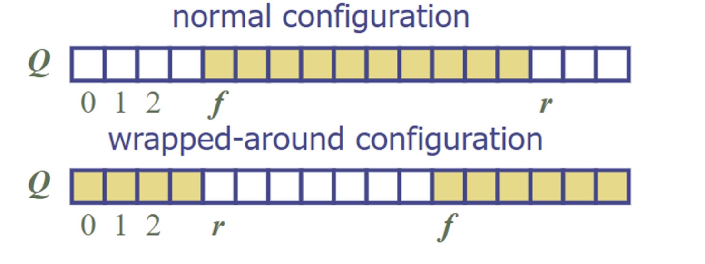

# Queue

A queue is a container of objects that are inserted and removed according to the FIRST-IN-FIRST-OUT principle, aka elements enter at the rear and removed at the front. It runs in O(1) time complexity and takes up O(n) space.

## Main Queue Operations

1. Init():  Initializes the queue to empty.
2. enqueue(o): insert object o at the rear of the queue
3. dequeue(): remove and return from the queue the object at the front; error occurs if queue is empty

## Auxilliary Operations

1. first(): returns the last inserted element without removing it.
2. size(): returns the number of elements stored
3. isEmpty(): indicates whether no elements are stored

# Array-Based Queue

An array-based queue will use an array of size N in a circular fashion along with two pointers to keep track of the front and rear of the queue. When the queue has fewer than N elements, array location r = (f + size) mod N  is the first empty slot past the rear of the queue

1. Enqueue: To add an item to the queue, it is placed at the position indicated by the rear pointer, and then the rear pointer is moved forward (incremented).
2. Dequeue: To remove an item from the queue, the item at the front pointer is removed, and then the front pointer is moved forward (incremented).

### Downside

This can lead to wasted space, aka array shrinkage. As items are dequeued from the front, space at the beginning of the array is not reused, leading to a situation where the array might be full, but still have unused spaces at the front. 

## Example

1. Example: Imagine an array items of length 5, and self.rear currently at index 4 (the last position). When incrementing self.rear, we get (4 + 1) % 5 = 0. So, self.rear wraps around to index 0, allowing us to use the array in a circular fashion.