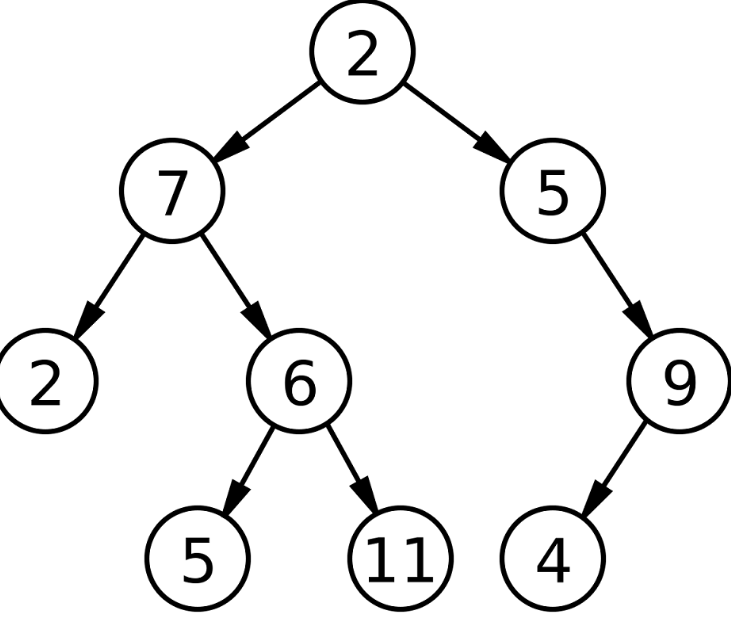
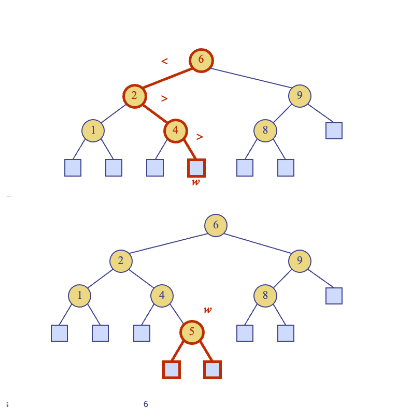
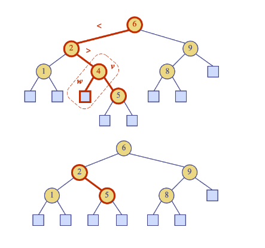
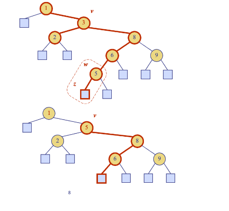

# Binary Search Algorithm

The binary search algorithm works by cutting an array in half and checking if the value is the desired key or not. 

```python
def binary_search(arr, k, low, high):
    Input: An ordered array, arr, storing n items whos keys are accessed with method key(i) and whos elements are accessed with method elem(i); a search key k; and integers low and high
    Output: An element of arr with key k and index between low and high, if such an element exists, and otherwise the special element null

    if low > high:
        return None
    else:
        mid = (low + high) // 2
        if k == arr[mid]:
            return mid
        elif k < arr[mid]:
            return binary_search(arr, k, low, mid - 1)
        else:
            return binary_search(arr, k, mid + 1, high)
```



This function takes an array, a key, and a range from low to high to search k in. It will return the index of 'k' if itt is in the array or None if not. 

# Tree Search

Given a search key k and a node v of T , TreeSearch returns a node (position) w of the subtree T (v) of T rooted at v, such that one of the following two cases occurs:

1. w is an internal node of T (v) that stores key k.
2. w is an external node of T (v)
    * All the internal nodes of T (v) that precede w in the inorder traversal have keys smaller than k, and all the internal nodes of T (v) that follow w in the inorder traversal have keys greater than k*

```python
class TreeNode:
    def __init__(self, key, left=None, right=None):
        self.key = key
        self.left = left
        self.right = right

def tree_search(k, v):
    if v is None:  # If v is an external node (or None in Python)
        return None
    if k == v.key:  # If the key is found
        return v
    elif k < v.key:  # If the key is less than the current node's key, search the left subtree
        return tree_search(k, v.left)
    else:  # If the key is greater than the current node's key, search the right subtree
        return tree_search(k, v.right)
```

Tree Search will recursively search for a key in a key in the tree, returning the node containing the key if it exists, or None if the key is not found in the tree. This can be used on any tree data structure and takes O(log n).

## Insertion

To insert a node, we look for an external node and add the internal node with the two values. To perform operation put(k, o), we search for key k (using TreeSearch). We assume k is not already in the tree, and let w be the leaf reached by the search. Finally, we insert k at node w and expand w into an internal node.


```python
  def insert(self, k, e):
        node_to_insert = self.tree_search(k, self.root)
        
        while node_to_insert is not None and node_to_insert.key != k:
            if k < node_to_insert.key:
                node_to_insert = self.tree_search(k, node_to_insert.left)
            else:
                node_to_insert = self.tree_search(k, node_to_insert.right)

        if node_to_insert is None:
            # If the tree is empty, create a new root node
            self.root = TreeNode(k, e)
        elif k < node_to_insert.key:
            # If the key should go to the left of node_to_insert
            node_to_insert.left = TreeNode(k, e)
        elif k > node_to_insert.key:
            # If the key should go to the right of node_to_insert
            node_to_insert.right = TreeNode(k, e)
        # If the key is already in the tree, we might update the value
        # or decide not to insert a duplicate, depending on the use case
```


In this image, we search for key 5 using Tree Search. We assume 5 is not in the tree and we have reached the bottom at node w. We insert 5 at node w and expand w into an internal node to make room for it by giving it two children. 

## Deletion

To delete a key, we search for an internal node storing the value and remove it. If it returns an external node, it returns NULL. If one of the children of node w is an external node, say node z, we simply remove w and z from T , and replace w with the sibling of z.

 ```python
 def remove(self, key, node):
        if node is None:
            return node
        if key < node.key:
            node.left = self.remove(key, node.left)
        elif key > node.key:
            node.right = self.remove(key, node.right)
        else:
            # Node with only one child or no child
            if node.left is None:
                temp = node.right
                node = None
                return temp
            elif node.right is None:
                temp = node.left
                node = None
                return temp

            # Node with two children:
            # Get the in-order successor (smallest in the right subtree)
            temp = self.find_min(node.right)

            # Copy the in-order successor's content to this node
            node.key = temp.key

            # Delete the in-order successor
            node.right = self.remove(temp.key, node.right)
        
        return node

    def delete_key(self, key):
        self.root = self.remove(key, self.root)

 ```


In this image, we search for key 4 using Tree Search. Since 4 has a lead child w that has no children, we remove 4 and w from the tree with operation removeExternal(w). This will remove w and its parent. 



In this example, we want to remove key 3 at node v. Since node v has two internal children (both of its children have children and thus cannot ve removed), we will instead find the internal node w that follows v in an inorder traversal. It will choose w because it is the smallest node and fulfills the BST properties. Then, we copy key(w) into node v and we remove node w and its left child z (which must be a leaf) by means of operation removeExternal(z). 