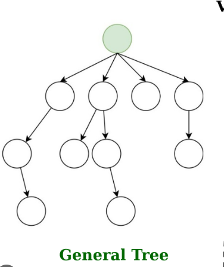
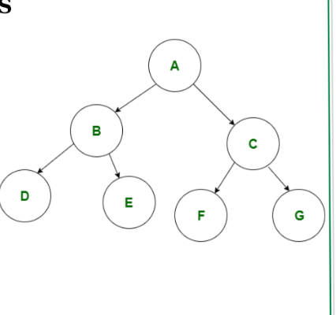
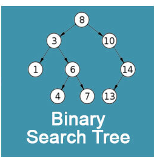

# Trees

A tree is a data structure that stores elements heirarchically with the root as the top element and parent/children being the subtrees. Nodes store elements in a parent/child relationship, an **internal** node has at least one child while an **external** node has none.



This image is a general tree structure because the root node has 4 children, making it not a binary Tree. 

## Depth 

The depth of a tree is the total number of ancestors excluding the root itself, meaning the depth of the root is always 0 and the depth of the root v is (1 + depth of parent of v). 

```python
Algorithm depth(T, v):
    if T.isRoot(v) then
        return 0
    else
        return 1 + depth(T, T.parent(v))
```

*This algorithm computes the depth by recursively calling itself on the parent of v, and adding 1 to the value returned. The running time is O(1 + dv ) where dv is the depth of the node v in the tree.

## Height 
The height of a tree is the maximum depth of any node, so if v is an external node then the height of v is 0. Otherwise, the height of v is one plus the maximum height of a child of v.

```python
Algorithm height(T, v):
    if T.isExternal(v) then
        return 0
    else
        leftHeight = findHeight(node.left)
        rightHeight = findHeight(node.right)
        
        If leftHeight > rightHeight
            Return leftHeight + 1
        Else
            Return rightHeight + 1
```

This function works by recursively calculating the height of the left and right subtrees for each node, then taking the larger of the two heights and adding one (to account for the edge connecting to the parent node). The base case for the recursion is when the function encounters a NULL node (indicating an empty tree or the end of a branch), where it returns -1. This ensures that for a single node tree, the height will be correctly calculated as 0 (since -1 + 1 = 0).

## Tree Methods

1. root(): Return the root of the tree.
2. parent(v): Return the parent of node v; an error occurs if v is root.
3. children(v): Return a set containing the children of node v

## Ordered Tree

An ordered tree is a tree with a linear ordering defined for the children of each node. It can identofy children of a node as being the first, second, third, etc. This type of tree works well in nested directories like OS folders.

## Binary Tree

A binary tree is an ordered tree where each node has at most two children. It is called a proper binary tree when each internal node has two children. 


This is a binary tree, as shown by each node having at most two children. 

### Properties of a Binary Tree

Let T be a proper binary tree with n nodes, and let h denote the
height of T. Then T has the following properties:

1. The number of external nodes in T is at least h + 1 and at most 2h.
2. The number of internal nodes in T is at least h and at most 2h − 1.
3. The total number of nodes in T is at least 2h + 1 and at most 2h+1 − 1.
4. The height of T is at least log(n + 1) − 1 and at most (n − 1)/2, that is, log(n + 1) − 1 ≤ h ≤ (n − 1)/2.

There is no specific ordering in terms of how the nodes are arranged or the values that they hold. This means that **the left child can have a value greater or less than its parent, and the same goes for the right child.**

## Binary Search Tree
 
A binary search tree is a special binary tree that maintains a sorted order of elements. 

### BST Properties

1. In a BST, the left child of a node contains a value less than its parent node, and the right child of a node contains a value greater than its parent node. This property applies to every node in the tree and is what gives a BST its name and sorted characteristic.
2. The ordering of nodes in a BST allows for efficient searching, insertion, and deletion operations, which can be performed in O(log⁡ n) time complexity in a balanced BST.
3. Because of this order property, an in-order traversal of a BST will visit the nodes in ascending sorted order.



In this image, all left nodes are smaller than their parents, and all right nodes are greater than their parents. 

## Decision Tree

A decision tree is a binary tree associated with a decision process. The internal nodes are yes/no questions while the external nodes are the decisions. 

# Traversal

Traversal is the systematic way of visiting all nodes of T.

## Preorder Traversal

Preorder traversal is when the root of T is visited first and then the subtree rooted at its children are traversed recursively. Aka, a node is visited before its descendents. This is usefull for linear ordering of nodes or printing a structured document.

```python
Algorithm preorder(T, v):
    perform the "visit" action for node v
    for each child w of v do
        recursively traverse the subtree rooted at w by calling preorder(T,w)
```

```python
Algorithm binaryPreorder(T,v):
    perform the "visit" action for node v
    if v is an internal node then
        binaryPreorder(T, T.leftChild(v))
        binaryPreorder(T, T.rightChild(v))
```

## Postorder Traversal

Postorder traversal will recursively traverse the subtrees rooted at the children of the root first, and then visit the root. Aka, a node is visited after its descendents. This runs in linear time by taking O(n) with n nodes and assuming that visiting each node takes O(1) time.

```python
Algorithm postorder(T, v):
    for each child w of v do
        recursively traverse the subtree rooted at w by calling postorder(T,w)
    perform the "visit" action for node v
```

```python
Algorithm binaryPostorder(T,v):
    if v is an internal node then
        binaryPostorder(T, T.leftChild(v))
        binaryPostorder(T, T.rightChild(v))
    perform the "visit" action for node v
```

## Inorder Traversal

Inorder Traversal will visit a node between the recursive traversals of its left and right subtrees. Aka, a node is visited after its left subtree and before its right subtree (Left, Top, Right).

```python
Algorithm inorder(T, v):
    if v is an internal node then
        inorder(T, T.leftchild(v))
    perform the "visit" action for node v
    if v is an internal node then
        inorder(T, T.rightchild(v))
    
```